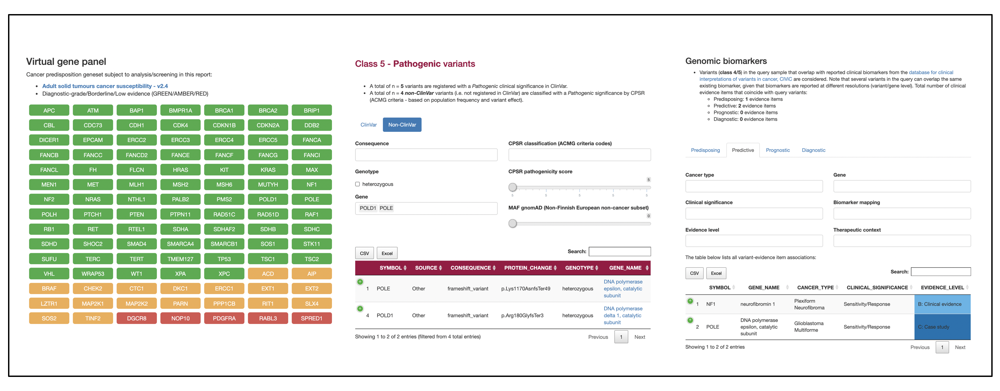

# Cancer Predisposition Sequencing Reporter (CPSR)

The *Cancer Predisposition Sequencing Reporter (CPSR)* is a computational workflow that **interprets and classifies germline DNA variants** identified from next-generation sequencing **in the context of cancer predisposition and inherited cancer syndromes**. The workflow can also report **incidental findings (ACMG v3.0)** as well as the genotypes of common germline variants associated with cancer risk, as reported in the **NHGRI-EBI GWAS catalog**.

The CPSR workflow is integrated with the framework that underlies the [Personal Cancer Genome Reporter - PCGR](https://github.com/sigven/pcgr). While *PCGR* is intended for reporting and analysis of somatic variants detected in a tumor, 

*CPSR* accepts a query file from a single case/patient, containing raw germline variant calls encoded in the [VCF](https://samtools.github.io/hts-specs/VCFv4.2.pdf) format (i.e. SNVs/InDels). A comprehensive set of **virtual cancer predisposition gene panels** harvested from the [Genomics England PanelApp](https://panelapp.genomicsengland.co.uk/) allows the user to flexibly put a restriction on which genes and findings are displayed in the cancer predisposition report.

Snapshots of sections in the cancer predisposition genome report:

## News

-   *February 2022*: **x.x.x release**

    -   Complete restructure of code and Conda installation routines, contributed largely by the great [@pdiakumis](https://github.com/pdiakumis)
    -   Updated data bundle
        - ClinVar - Feb 2022
        - CancerMine - Dec 2021
        - UniprotKB - Nov 2021
        - CIViC - Feb 2022
        - GWAS catalog - Dec 2021
    -   Software upgrade (VEP 105, R/BioConductor)
    -   New documentation site ([https://sigven.github.io/cpsr](https://sigven.github.io/cpsr))

-   *June 30th 2021*: **0.6.2 release**

    -   Updated bundle (ClinVar, CancerMine, UniprotKB, PanelApp, CIViC, GWAS catalog)
    -   Software upgrade (VEP, R/BioConductor)
    -   [CHANGELOG](http://cpsr.readthedocs.io/en/latest/CHANGELOG.html)

-   *November 30th 2020*: **0.6.1 release**

    -   Updated bundle (ClinVar, CancerMine, UniprotKB, CIViC, GWAS catalog)
    -   [CHANGELOG](http://cpsr.readthedocs.io/en/latest/CHANGELOG.html)

## Example report

## Getting started

-   [Installation instructions](https://sigven.github.io/cpsr/articles/installation.html)
-   [Run through an example](https://sigven.github.io/cpsr/articles/running.html#example-run)
-   Learn more about
    * Details regarding the [CPSR input file](https://sigven.github.io/cpsr/articles/input.html), and how it should be formatted
    * The types and contents of [CPSR output files](https://sigven.github.io/cpsr/articles/output.html)
    * [ACMG variant classification procedure](https://sigven.github.io/cpsr/articles/variant_classification.html) used in CPSR
    * The list of [virtual gene panels](https://sigven.github.io/cpsr/articles/virtual_panels.html) available in CPSR

## Citation

If you use CPSR, please cite the following publication:

Sigve Nakken, Vladislav Saveliev, Oliver Hofmann, Pål Møller, Ola Myklebost, and Eivind Hovig. **Cancer Predisposition Sequencing Reporter (CPSR): a flexible variant report engine for high-throughput germline screening in cancer** (2021). *Int J Cancer*. [doi:[10.1002/ijc.33749](doi:%5B10.1002/ijc.33749)](https://doi.org/10.1002/ijc.33749)

## Contact

[sigven\@ifi.uio.no](mailto:sigven@ifi.uio.no)
