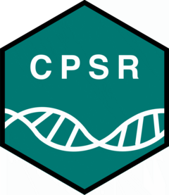
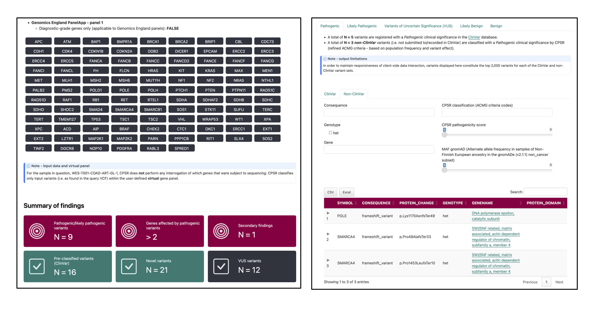

# Cancer Predisposition Sequencing Reporter 

The *Cancer Predisposition Sequencing Reporter (CPSR)* is a computational workflow that **interprets DNA sequence variants** identified from next-generation sequencing **in the context of cancer predisposition**. 

*CPSR* accepts a query file with _germline_ variant calls (SNVs/InDels) from a single sample (i.e. cancer patient), encoded in the [VCF format ](https://samtools.github.io/hts-specs/VCFv4.2.pdf). Through comprehensive gene and variant annotation procedures, CPSR offers the following functionalities to the user:

1)  Flexible **selection of cancer predisposition genes** subject to analysis and reporting - through the use of virtual gene panels
2)  **Variant classification** (*Pathogenic* to *Benign*) through a dedicated implementation of [ACMG/AMP guidelines](https://pubmed.ncbi.nlm.nih.gov/25741868/)
3)  **Detection of germline biomarkers** - for prognosis, diagnosis, or drug sensitivity/resistance in cancer
4)  Reporting of **secondary/incidental findings** ([ACMG recommendations](https://pubmed.ncbi.nlm.nih.gov/37347242/))
5)  **Interactive HTML output report** with detailed variant information, gene annotations, and external links to relevant databases

The CPSR workflow is integrated with the framework that underlies the [Personal Cancer Genome Reporter - PCGR](https://github.com/sigven/pcgr). While *PCGR* is intended for reporting and analysis of somatic variants detected in a tumor, *CPSR* is intended for reporting and ranking of germline variants in protein-coding genes that are implicated in cancer predisposition and inherited cancer syndromes.

Snapshots of sections in the [quarto](https://quarto.org)-based cancer predisposition genome report (artificial sample, with more findings than usual) are shown below:

## News

*  *September 17th 2025*: **2.2.5 release**
    -  patch - safeguard against missing data in gnomAD non-cancer variant data
       using global gnomAD MAF's as fallback
    -  [CHANGELOG](https://sigven.github.io/cpsr/articles/CHANGELOG.html)

*  *September 8th 2025*: **2.2.4 release**
    -  patch to avoid duplicate matching of PVS1 criteria

*  *March 23rd 2025*: **2.2.1 release**
    -  patch to fix bug with non-standard ClinVar significance levels (Drug Response, Risk Factor)

*  *March 22nd 2025*: **2.2.0 release**
    -  more predisposition genes in panel zero 
    -  optional reporting of pharmacogenomics-related variants (TPMT, DPYD, NUDT15)
    -  [CHANGELOG](https://sigven.github.io/cpsr/articles/CHANGELOG.html)

*  *October 2024*: **2.1.2 release**
    -  cosmetic fixes in HTML report
    -  fix for VEP consequence pick exception
    -  [CHANGELOG](https://sigven.github.io/cpsr/articles/CHANGELOG.html)
    
*  *September 2024*: **2.1.0 release**
    -  data bundle upgrade
    -  re-calibration of classification tresholds
    -  [CHANGELOG](https://sigven.github.io/cpsr/articles/CHANGELOG.html)

*  *June 2024*: **2.0.0 release**
    -  New HTML report generation and layout with [quarto](https://quarto.org/)
    -  Excel output supported
    -  Data bundle update
    -  Singularity/Apptainer support
    -  [CHANGELOG](http://cpsr.readthedocs.io/en/latest/CHANGELOG.html)

*  *November 2022*: **1.0.1 release**
    -  Added CPSR logo (designed by [Hal Nakken](https://halvetica.net))

## Example report

## Getting started

-   [Installation instructions](https://sigven.github.io/cpsr/articles/installation.html)
-   [Run through an example](https://sigven.github.io/cpsr/articles/running.html#example-run)
-   Learn more about
    -   Details regarding the [CPSR input file](https://sigven.github.io/cpsr/articles/input.html), and how it should be formatted
    -   The types and contents of [CPSR output files](https://sigven.github.io/cpsr/articles/output.html)
    -   [ACMG variant classification procedure](https://sigven.github.io/cpsr/articles/variant_classification.html) used in CPSR
    -   The list of [virtual gene panels](https://sigven.github.io/cpsr/articles/virtual_panels.html) available in CPSR

## Citation

If you use CPSR, please cite the following publication:

Sigve Nakken, Vladislav Saveliev, Oliver Hofmann, Pål Møller, Ola Myklebost, and Eivind Hovig. **Cancer Predisposition Sequencing Reporter (CPSR): a flexible variant report engine for high-throughput germline screening in cancer** (2021). *Int J Cancer*. [doi:[10.1002/ijc.33749](doi:%5B10.1002/ijc.33749)](https://doi.org/10.1002/ijc.33749)

## Contact

[sigven\@ifi.uio.no](mailto:sigven@ifi.uio.no)
