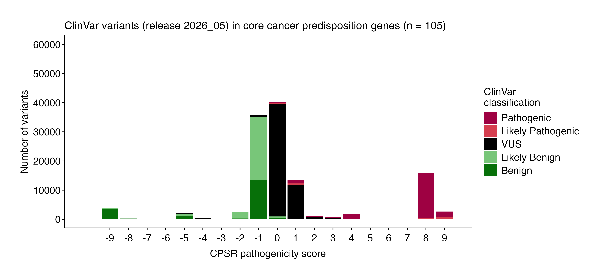

# Variant classification

Variants in the cancer predisposition gene set are classified through
two complementary assertion authorities:

- **CPSR** — All coding variants are classified *de novo* by CPSR
  according to a *five-level pathogenicity scheme*
  (*CPSR_CLASSIFICATION*): pathogenic / likely pathogenic / VUS / likely
  benign / benign. The classification is rule-based, implementing a key
  subset of published **ACMG/AMP criteria**. Gene-level attributes
  relevant to pathogenicity assessment — including mode of inheritance
  and mechanism of disease (loss-of-function vs. gain-of-function) — are
  sourced from [Genomics England
  PanelApp](https://panelapp.genomicsengland.co.uk/), [Maxwell et al.,
  Am J Hum Genet, 2016](https://www.ncbi.nlm.nih.gov/pubmed/27153395),
  and [Huang et al., Cell,
  2018](https://www.ncbi.nlm.nih.gov/pubmed/29625052). Importantly, note
  that some ACMG/AMP criteria have been accommodated with gene-specific
  recommendations:
  - BA1/BS1/PM2 allele-specific thresholds (as specified by [ClinGen
    VCEPs](https://cspec.genome.network/cspec/ui/svi/) for key
    cancer-predisposing genes, i.e. BRCA1/2, MMR genes, PALB2, APC, ATM,
    PTEN, TP53).
  - PM4 - exceptions for TP53 and ATM
  - PM1 - regional considerations for matching against TP53 and PTEN,
    and exceptions for PALB2, ATM, APC, MMR genes and BRCA1/2
- **ClinVar** — For variants with an existing record in
  [ClinVar](https://www.ncbi.nlm.nih.gov/clinvar/), the ClinVar
  interpretation may override the CPSR-computed classification as the
  final reported verdict. Whether this override applies depends on the
  *clinvar_trust_level* setting: at higher trust levels, only
  classifications backed by expert panel review or multiple submitters
  with no conflicts are accepted; at lower trust levels, a broader set
  of ClinVar submissions is considered sufficient to override CPSR. If a
  variant’s ClinVar record does not meet the configured trust threshold,
  the CPSR rule-based classification is retained as the final call.

The ACMG/AMP criteria listed in the criteria table below form the basis
for the *CPSR_CLASSIFICATION* variable. The *score* column indicates how
much each evidence item contributes to either of the two pathogenicity
poles (positive values indicate pathogenic support, negative values
indicate benign support). Scores along each pole (‘B’ and ‘P’) are
aggregated and represented through the *CPSR_PATHOGENICITY_SCORE*
variable. See the calibration section below on how CPSR establishes
optimal thresholds for converting pathogenicity scores to categorical
classification levels.

| Tag | Description |
|----|----|
| 1\. `ACMG_PM1` (**2**) | Evidence that a variant is located in a mutational hotspot or critical functional domain without benign variation. |
| 2\. `ACMG_PM1_SUPP` (**1**) | Supporting evidence that a variant lies in a known functional hotspot or critical domain (supporting strength). |
| 3\. `ACMG_PM2_SUPP` (**0**) | Supporting evidence that the variant is absent or extremely rare in population databases (supporting strength). |
| 4\. `ACMG_BA1` (**-8**) | Stand-alone evidence that the variant’s allele frequency is too high for a pathogenic classification. |
| 5\. `ACMG_BP1` (**0**) | Supporting evidence that a missense variant occurs in a gene where truncating variants are predominantly known to cause disease. |
| 6\. `ACMG_BP4` (**-1**) | Supporting evidence that multiple computational tools predict a benign effect on the gene or gene product. |
| 7\. `ACMG_BP7` (**-1**) | Supporting evidence that a silent (synonymous) variant has no predicted impact on splicing or gene function. |
| 8\. `ACMG_BS1` (**-4**) | Strong evidence that the variant’s allele frequency is greater than expected for a disorder. |
| 9\. `ACMG_BS1_SUPP` (**-1**) | Supporting evidence that the variant’s frequency is slightly higher than expected for a pathogenic variant. |
| 10\. `ACMG_PVS1` (**8**) | Very strong evidence that a null (loss-of-function) variant occurs in a gene where loss of function is a known disease mechanism. |
| 11\. `ACMG_PVS1_STR` (**4**) | Strong evidence for a predicted loss-of-function variant (reduced strength from PVS1). |
| 12\. `ACMG_PVS1_MOD` (**2**) | Moderate evidence for a predicted loss-of-function variant (further reduced strength from PVS1). |
| 13\. `ACMG_PS1` (**4**) | Strong evidence that the variant causes the same amino acid change as a previously established pathogenic variant but via a different nucleotide change. |
| 14\. `ACMG_PP3` (**1**) | Supporting evidence that multiple computational tools predict a deleterious effect on the gene or gene product. |
| 15\. `ACMG_PM5` (**2**) | Evidence that the variant causes a novel amino acid change at a residue where another pathogenic missense change has been seen. |
| 16\. `ACMG_PM4` (**2**) | Evidence that the variant results in protein length changes due to in-frame deletions/insertions in a non-repeat region or stop-loss in functional protein domains. |
| 17\. `ACMG_PM4_SUPP` (**1**) | Evidence that the variant results in protein length changes due to in-frame deletions/insertions in a non-repeat region or stop-loss in functional protein domains (single amino acid changes). |
| 18\. `ACMG_PP2` (**0**) | Supporting evidence that a missense variant occurs in a gene with low benign missense variation and where missense variants are a common disease mechanism. |

## Calibration of classification thresholds

How does CPSR assign a standard classification label (*P, LP, VUS, LB,
B*) from the aggregated variant pathogenicity score
(*CPSR_PATHOGENICITY_SCORE*)?

Optimal thresholds for conversion of pathogenicity scores to categorical
variant classification were calibrated through high-quality
ClinVar-classified variants (**minimum two gold stars** with respect to
review status) in a core set of cancer predisposition genes (see plot
below).

The following thresholds are currently used to assign classifications
based on pathogenicity scores:

| CPSR_CLASSIFICATION | CPSR_PATHOGENICITY_SCORE |
|:--------------------|:-------------------------|
| Pathogenic          | **\[4, \]**              |
| Likely Pathogenic   | **\[2, 3\]**             |
| VUS                 | **\[0, 1\]**             |
| Likely Benign       | **\[-3, -1\]**           |
| Benign              | **\[, -4\]**             |

Although the final CPSR pathogenicity score per variant is derived from
a summation of matching evidence scores/weights, certain weights are
downgraded in particular contexts. Specifically, the weight provided by
supportive computational predictions (e.g. **PP3**, **BP4**) will not
count towards the final pathogenicity score if no other weight is
provided by other criteria. Also, if a variant has only a single
(non-strong, i.e. moderate/supporting) pathogenic evidence criterion
matching, yet reaching CPSR’s likely pathogenic score threshold, it will
be downgraded to a VUS in order to avoid overclassification based on
limited evidence (in line with ACMG/AMP guidelines).

Note that the score thresholds above may be subject to change in future
CPSR releases, as we continue to refine and optimize our classification
algorithm based on emerging evidence and user feedback.
