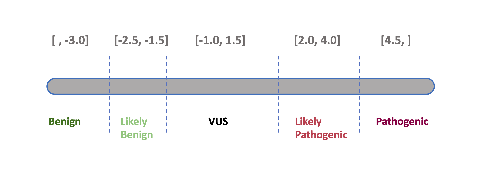

# Variant classification

All coding variants in the set of genes subject to screening are
classified according to a *standard, five-level pathogenicity scheme*
(coined **CPSR_CLASSIFICATION**). The scheme has the same five levels as
those employed by ClinVar, i.e.

- pathogenic (**P**)
- likely pathogenic (**LP**)
- variant of uncertain significance (**VUS**)
- likely benign (**LB**)
- benign (**B**)

By default, the presence of a non-conflicting ClinVar classification
(**CLINVAR_CLASSIFICATION**) for a given variant will have precedence
over the CPSR classification, i.e. if a variant has a ClinVar
classification it will be reported as such in the CPSR report. However,
users can choose the CPSR classification for all variants regardless of
existing classifications (see [CPSR
settings](https://sigven.github.io/cpsr/dev/articles/settings.html#variant-classification-settings)
for more information).

The classification performed by CPSR is rule-based, implementing most of
the ACMG criteria related to *variant effect* and *population
frequency*, which have been outlined in
[SherLoc](https://www.invitae.com/en/variant-classification/) ([Nykamp
et al., Genetics in Medicine,
2017](https://www.ncbi.nlm.nih.gov/pubmed/28492532)), and also some in
[CharGer](https://github.com/ding-lab/CharGer). Information on cancer
predisposition genes (mode of inheritance, loss-of-funcion mechanism
etc.) is largely harvested from [Maxwell et al., Am J Hum Genet,
2016](https://www.ncbi.nlm.nih.gov/pubmed/27153395).

The ACMG/AMP criteria listed below form the basis for the tier assigned
to the **CPSR_CLASSIFICATION** variable. Specifically, the **score** in
parenthesis indicates how much each evidence item contributes to either
of the two pathogenicity poles (positive values indicate pathogenic
support, negative values indicate benign support). Evidence score along
each pole (‘B’ and ‘P’) are aggregated, and if there is conflicting or
little evidence it will be classified as a VUS. This classification
scheme has been adopted by the one outlined in
[SherLoc](https://www.ncbi.nlm.nih.gov/pubmed/28492532).

| Tag | Description |
|----|----|
| 1\. `ACMG_PM1` (**2**) | Evidence that a variant is located in a mutational hotspot or critical functional domain without benign variation. |
| 2\. `ACMG_PM1_SUPP` (**1**) | Supporting evidence that a variant lies in a known functional hotspot or critical domain (supporting strength). |
| 3\. `ACMG_PM2_SUPP` (**0**) | Supporting evidence that the variant is absent or extremely rare in population databases (supporting strength). |
| 4\. `ACMG_BA1` (**-8**) | Stand-alone evidence that the variant’s allele frequency is too high for a pathogenic classification. |
| 5\. `ACMG_BP1` (**0**) | Supporting evidence that a missense variant occurs in a gene where truncating variants are predominantly known to cause disease. |
| 6\. `ACMG_BP4` (**-1**) | Supporting evidence that multiple computational tools predict a benign effect on the gene or gene product. |
| 7\. `ACMG_BP7` (**-1**) | Supporting evidence that a silent (synonymous) variant has no predicted impact on splicing or gene function. |
| 8\. `ACMG_BS1` (**-4**) | Strong evidence that the variant’s allele frequency is greater than expected for a disorder. |
| 9\. `ACMG_BS1_SUPP` (**-1**) | Supporting evidence that the variant’s frequency is slightly higher than expected for a pathogenic variant. |
| 10\. `ACMG_PVS1` (**8**) | Very strong evidence that a null (loss-of-function) variant occurs in a gene where loss of function is a known disease mechanism. |
| 11\. `ACMG_PVS1_STR` (**4**) | Strong evidence for a predicted loss-of-function variant (reduced strength from PVS1). |
| 12\. `ACMG_PVS1_MOD` (**2**) | Moderate evidence for a predicted loss-of-function variant (further reduced strength from PVS1). |
| 13\. `ACMG_PS1` (**4**) | Strong evidence that the variant causes the same amino acid change as a previously established pathogenic variant but via a different nucleotide change. |
| 14\. `ACMG_PP3` (**1**) | Supporting evidence that multiple computational tools predict a deleterious effect on the gene or gene product. |
| 15\. `ACMG_PM5` (**2**) | Evidence that the variant causes a novel amino acid change at a residue where another pathogenic missense change has been seen. |
| 16\. `ACMG_PM4` (**2**) | Evidence that the variant results in protein length changes due to in-frame deletions/insertions in a non-repeat region or stop-loss in functional protein domains. |
| 17\. `ACMG_PM4_SUPP` (**1**) | Evidence that the variant results in protein length changes due to in-frame deletions/insertions in a non-repeat region or stop-loss in functional protein domains (single amino acid changes). |
| 18\. `ACMG_PP2` (**0**) | Supporting evidence that a missense variant occurs in a gene with low benign missense variation and where missense variants are a common disease mechanism. |

  
As of September 2025, based on a calibration against ClinVar-classified
variants (minimum two review status stars) in n = 105 core cancer
predisposition genes, the clinical significance
(**CPSR_CLASSIFICATION**) is determined based on the following ranges of
pathogenicity scores:

  

cpsr classification
