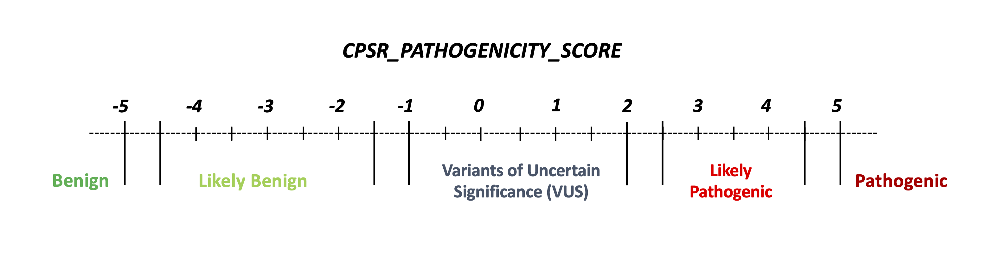

## Variant classification (ACMG/AMP)

All coding, <b>non-ClinVar</b> variants in the set of genes subject to screening have been classified according to a <i>standard, five-level pathogenicity scheme</i> (coined <b>CPSR_CLASSIFICATION</b>). The scheme has the same five levels as those employed by ClinVar, i.e.

* pathogenic (**P**)
* likely pathogenic (**LP**)
* variant of uncertain significance (**VUS**)
* likely benign (**LB**)
* benign (**B**)

The classification performed by CPSR is rule-based, implementing most of the ACMG criteria related to <i>variant effect</i> and <i>population frequency</i>, which have been outlined in [SherLoc](https://www.invitae.com/en/variant-classification/) ([Nykamp et al., Genetics in Medicine, 2017](https://www.ncbi.nlm.nih.gov/pubmed/28492532)), and also some in [CharGer](https://github.com/ding-lab/CharGer). Information on cancer predisposition genes (mode of inheritance, loss-of-funcion mechanism etc.) is largely harvested from [Maxwell et al., Am J Hum Genet, 2016](https://www.ncbi.nlm.nih.gov/pubmed/27153395).

The refined ACMG/AMP criteria listed below form the basis for the tier assigned to the <b>CPSR_CLASSIFICATION</b> variable. Specifically, the <b>score</b> in parenthesis indicates how much each evidence item contributes to either of the two pathogenicity poles (positive values indicate pathogenic support, negative values indicate benign support). Evidence score along each pole ('B' and 'P') are aggregated, and if there is conflicting or little evidence it will be classified as a VUS. This classification scheme has been adopted by the one outlined in [SherLoc](https://www.ncbi.nlm.nih.gov/pubmed/28492532).

1. ACMG_BA1_AD (**-5**) - Very high MAF (> 0.5% in gnomAD non-cancer pop subset) - min AN = 12,000 - Dominant mechanism of disease
2. ACMG_BS1_1_AD (**-3**)- High MAF (> 0.1% in gnomAD non-cancer pop subset) - min AN = 12,000 - Dominant mechanism of disease
3. ACMG_BS1_2_AD (**-1**) Somewhat high MAF (> 0.005% in gnomAD non-cancer pop subset) - Dominant mechanism of disease
4. ACMG_BA1_AR (**-5**) - Very high MAF (> 1% in gnomAD non-cancer pop subset) - min AN = 12,000 - Recessive mechanism of disease
5. ACMG_BS1_1_AR (**-3**)- High MAF (> 0.3% in gnomAD non-cancer pop subset) - min AN = 12,000 - Recessive mechanism of disease
6. ACMG_BS1_2_AR (**-1**)- Somewhat high MAF (> 0.005% in gnomAD non-cancer pop subset) - Recessive mechanism of disease
7. ACMG_BP3 (**-2.5**) - Non-coding variant in the UTR or promoter region
8. ACMG_BP7 (**-2.5**) - Silent and intronic changes outside of the consensus splice site
9. ACMG_BP4 (**-1**)- Multiple lines (>=5) of computational evidence support a benign effect on the gene or gene product (conservation, evolutionary, splicing impact, etc. - from dbNSFP
10. ACMG_BMC1 (**0**)- Peptide change is at the same location of a known benign change (ClinVar)
11. ACMG_BSC1 (**-3**)- Peptide change is reported as benign (ClinVar)
12. ACMG_BP1 (**-0.5**)- Missense variant in a gene for which primarily truncating variants (>90% of pathogenic variants) are known to cause disease (ClinVar)
13. ACMG_PM2_1 (**0.5**)- Allele count within pathogenic range (MAF <= 0.005% in the population-specific non-cancer gnomAD subset)
14. ACMG_PM2_2 (**1**)- Alternate allele absent in the population-specific non-cancer gnomAD subset
15. ACMG_PVS1_1 (**5**) - Null variant (frameshift/nonsense) - predicted as LoF by LOFTEE - within pathogenic range - LoF established for gene
16. ACMG_PVS1_2 (**2.5**)- Null variant (frameshift/nonsense) - not predicted as LoF by LOFTEE - within pathogenic range - LoF established for gene
17. ACMG_PVS1_3 (**2**) - Null variant (frameshift/nonsense) - predicted as LoF by LOFTEE - within pathogenic range - LoF not established for gene
18. ACMG_PVS1_4 (**0**) - Null variant (frameshift/nonsense) - not predicted as LoF by LOFTEE -- within pathogenic range - LoF not established for gene
19. ACMG_PVS1_5 (**2.5**) - Start (initiator methionine) lost - within pathogenic range - Lof established for gene
20. ACMG_PVS1_6 (**2**) - Start (initiator methionine) lost - within pathogenic range - LoF not established for gene
21. ACMG_PVS1_7 (**4**) - Donor/acceptor variant - predicted as LoF by LOFTEE - within pathogenic range - not last intron - LoF established for gene
22. ACMG_PVS1_8 (**2.5**) - Donor/acceptor variant - last intron - within pathogenic range - LoF established for gene
23. ACMG_PVS1_9 (**2**)- Donor/acceptor variant - not last intron - within pathogenic range - LoF not established for gene
24. ACMG_PVS1_10 (**2**) - Donor variant at located at the +3, +4 or +5 position of the intron -  within the pathogenic range
25. ACMG_PS1 (**4**) - Same amino acid change as a previously established pathogenic variant (ClinVar) regardless of nucleotide change
26. ACMG_PP2 (**0.5**) - Missense variant in a gene that has a relatively low rate of benign missense variation (<30%) and where missense variants are a common mechanism of disease (>50% P/LP (ClinVar))
27. ACMG_PM1 (**2**) - Missense variant in a somatic mutation hotspot as determined by cancerhotspots.org
28. ACMG_PM4 (**0**) - Protein length changes due to inframe indels or nonstop variant in non-repetitive regions of genes that harbor variants with a dominant mode of inheritance.
29. ACMG_PPC1 (**0**) - Protein length changes due to inframe indels or nonstop variant in non-repetitive regions of genes that harbor variants with a recessive mode of inheritance.
30. ACMG_PM5 (**1.5**) - Novel missense change at an amino acid residue where a different missense change determined to be pathogenic has been seen before (ClinVar)
31. ACMG_PP3 (**0.5**)- Multiple lines (>=5) of computational evidence support a deleterious effect on the gene or gene product (conservation, evolutionary, splicing impact, etc. - from dbNSFP

Currently, the **CPSR_CLASSIFICATION** is determined based on the following ranges of pathogenicity scores:

 

